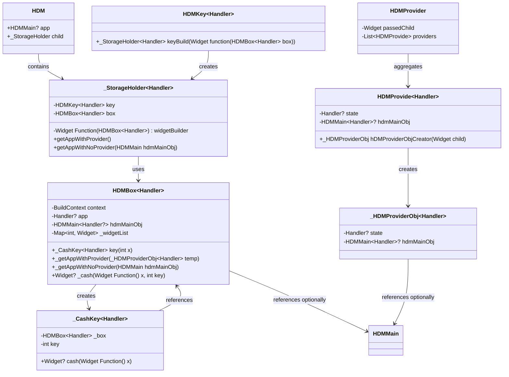

# HDM State Management System for Flutter

The HDM State Management System is a custom-built solution for managing state, widget lifecycle, and dependency injection in Flutter applications. It's designed to offer flexibility, efficient state management, and easy integration with the Flutter widget tree.

## System Overview

The system comprises several key components, each serving a specific role in managing state and widgets:

- **HDMBox**: A container that manages widgets and their state, capable of caching widgets to avoid unnecessary rebuilds.
- **HDM**: A `StatefulWidget` that acts as an entry point for the HDM system, managing the lifecycle of the HDMBox.
- **HDMKey**: Used for uniquely identifying and managing widgets and their state within the HDMBox.
- **HDMProvider**: Implements dependency injection, allowing state and functionality to be passed down the widget tree without manual prop drilling.

## How to Use

### Setup HDMBox

`HDMBox` acts as a container for your widgets and their state. It provides methods for caching widgets and accessing stateful data.

```dart
class MyWidget extends StatelessWidget {
  @override
  Widget build(BuildContext context) {
    // Use HDMBox to manage and cache your widget
    return Container(); // Your widget code here
  }
}
```

### Utilize HDM for State Management

Wrap your widget with `HDM` to manage its state. `HDM` requires a child of type `_StorageHolder`, which connects your widget with the HDMBox.

```dart
HDM(
  child: _StorageHolder(
    key: HDMKey(),
    widgetBuilder: (box) => MyWidget(),
    box: HDMBox(),
  ),
)
```

### Use HDMKey for Unique Identification

`HDMKey` is crucial for identifying and managing the state of widgets. Use it to uniquely identify each widget managed by HDMBox.

```dart
final myKey = HDMKey();
```

### Managing Dependencies with HDMProvider

`HDMProvider` and `HDMProvide` are used to inject dependencies down the widget tree. Define your providers and wrap your app or specific widgets with `HDMProvider`.

```dart
HDMProvider(
  passedChild: MyApp(),
  providers: [
    HDMProvide(state: YourState()),
  ],
)
```

### Accessing State and Context

Within your widgets, use `HDMBox` to access shared state or context as needed. `HDMBox` provides methods to interact with the global state and perform actions based on state changes.

```dart
class MyWidget extends StatelessWidget {
  @override
  Widget build(BuildContext context) {
    // Access HDMBox and state here
    return Container(); // Your widget code
  }
}
```

## Advanced Usage

- **Widget Caching**: Utilize `_CashKey` within `HDMBox` to cache widgets and improve performance.
- **Dependency Injection**: Use `HDMProvide` to manage and inject dependencies efficiently across your application.

## Conclusion

The HDM State Management System offers a structured and efficient way to manage state and dependencies in Flutter applications. By following the setup and usage examples provided, you can integrate HDM into your projects to enhance state management and widget lifecycle management.

For further customization and advanced use cases, refer to the detailed comments and documentation within each component of the system.